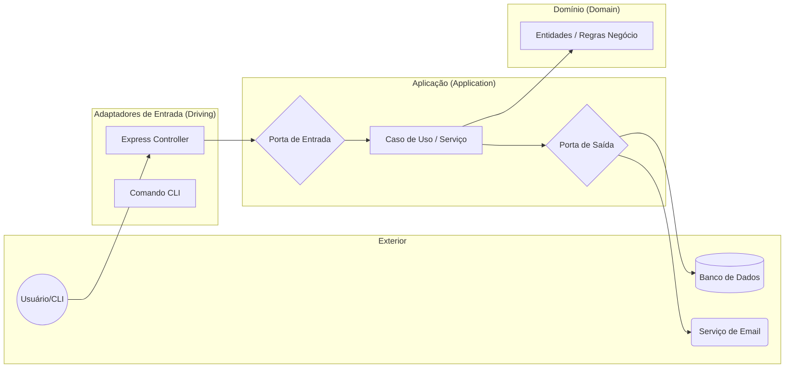

# Arquitetura Hexagonal (Portas e Adaptadores)

> **Resumo:** Padrão arquitetural que visa isolar o núcleo da aplicação (regras de negócio) de preocupações técnicas e externas (DB, UI, APIs), permitindo que a aplicação seja testada isoladamente e evoluída sem acoplamento.

Ver também: [[Arquitetura do Vault — Regras e Estrutura]] | [[dependency-inversion]] | [[clean-architecture]]

## Conceito Central

A ideia principal é o **Inside-Out**: o domínio está no centro e não conhece nada do mundo externo. A comunicação com o exterior acontece através de **Portas** (interfaces) e **Adaptadores** (implementações).

### O Hexágono e o Fluxo de Dependência

As dependências sempre apontam para o **centro** (Domínio).

## As Camadas

### 1. Domínio (Domain)
Onde vivem as **Entidades** e as regras de negócio puras. 
- **Regra de Ouro:** ZERO dependências externas (nem bibliotecas de banco de dados, nem frameworks web).

### 2. Aplicação (Application)
Orquestra o fluxo de dados. Contém os **Casos de Uso** e as **Portas** (Interfaces).
- Define **O QUE** a aplicação faz.

### 3. Infraestrutura (Infrastructure)
Contém os **Adaptadores**. 
- Define **COMO** a aplicação se comunica com o mundo (SQL, MongoDB, REST, gRPC).

---

## Portas e Adaptadores

### Portas (Interfaces)
- **Input Ports (Driving):** Definem como o mundo chama a aplicação (ex: `IUserService`).
- **Output Ports (Driven):** Definem como a aplicação chama o mundo (ex: `IUserRepository`).

### Adaptadores (Implementações)
- **Driving Adapters:** Chamam a porta de entrada (ex: `UserController` do Express).
- **Driven Adapters:** Implementam a porta de saída (ex: `SqlUserRepository`).
