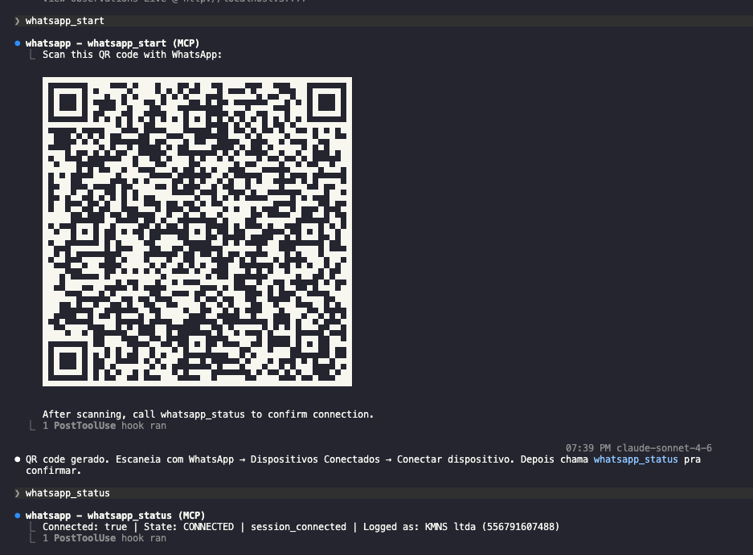

# whats-mcp

> MCP server para WhatsApp Web — instale uma vez, conecte qualquer AI CLI.

[](https://www.npmjs.com/package/@kaicnunes/whats-mcp)
[](https://nodejs.org)
[](https://modelcontextprotocol.io)
[](https://github.com/pedroslopez/whatsapp-web.js)

---

## O que é

`whats-mcp` é um servidor [MCP (Model Context Protocol)](https://modelcontextprotocol.io) que expõe o WhatsApp Web como ferramentas para qualquer AI CLI compatível (Claude Code, Cursor, Windsurf, Gemini CLI, etc.).

**Funcionalidades principais:**
- **Instalação via npm** — sem clonar repositório, sem configuração manual
- **Daemon compartilhado** — o primeiro CLI sobe o daemon; os demais reaproveitam o mesmo processo (e o mesmo Chromium)
- **Sessão persistente** — dados de auth salvos em disco, reconecta sem QR ao reiniciar
- **Múltiplas sessões** — vários números de WhatsApp simultaneamente
- **Swagger UI** — documentação REST em `http://localhost:47891/swagger`

---

## Demonstração

### Sessão conectada



### Enviando mensagem pela AI CLI


---

## Instalação rápida

```bash
npm install -g @kaicnunes/whats-mcp

whats-mcp install          # sobe daemon + registra auto-start no boot
whats-mcp start            # exibe QR code no terminal → escaneia com celular (uma vez só)
whats-mcp connect claude-code  # configura Claude Code automaticamente
```

O daemon inicia sozinho após reboot. A sessão WhatsApp é restaurada automaticamente — QR só na primeira vez.

---

## Comandos CLI

| Comando | Descrição |
|---|---|
| `whats-mcp install` | Sobe o daemon e registra auto-start no boot |
| `whats-mcp start [sessionId]` | Autentica WhatsApp — exibe QR code no terminal |
| `whats-mcp connect <cli>` | Configura a AI CLI automaticamente |
| `whats-mcp stop` | Para o daemon |
| `whats-mcp status` | Status do daemon (PID, HTTP, Swagger) |
| `whats-mcp logs [-f]` | Logs do daemon (`-f` para seguir em tempo real) |
| `whats-mcp send <número> <msg>` | Envia mensagem de teste (atalho CLI) |
| `whats-mcp restart [sessionId]` | Reinicia sessão WhatsApp (corrige estado travado/detached) |

**CLIs suportadas pelo `connect`:**

| CLI | Config editada |
|---|---|
| `claude-code` | `~/.claude/settings.json` |
| `cursor` | `~/.cursor/mcp.json` |
| `windsurf` | `~/.codeium/windsurf/mcp_config.json` |
| `gemini-cli` | `~/.gemini/settings.json` |

---

## Arquitetura

```
Claude Code / Cursor / Windsurf / Gemini CLI
    │
    │  stdio (MCP protocol)
    ▼
bin/cli.mjs  →  proxy  (index.mjs)
    │
    │  1. Verifica se daemon está rodando em :47891
    │  2. Se não: sobe daemon.mjs detached
    │  3. Conecta via SSE → proxeia stdin/stdout
    ▼
daemon.mjs  (servidor MCP SSE/HTTP, processo independente)
    │
    ├── GET  /sse              ← stream SSE para clientes MCP
    ├── POST /message          ← recebe JSON-RPC dos clientes
    ├── GET  /health           ← health check
    ├── POST /session/restart      ← reinicia sessão sem apagar autenticação
    └── GET  /swagger          ← Swagger UI
    │
    ▼
src/mcp-server.mjs  (factory com as 22 tools MCP)
    │
    ▼
src/sessions.js  →  whatsapp-web.js (Puppeteer/Chromium headless)
    │
    ▼
WhatsApp Web
```

Dados do daemon ficam em `~/.whats-mcp/` (PID, logs, .env).

---

## Pré-requisitos

- **Node.js >= 18**
- **WhatsApp** no celular para escanear o QR (apenas na primeira vez)
- Chromium é baixado automaticamente pelo Puppeteer no `npm install` (~170 MB)

---

## Variáveis de ambiente

| Variável | Padrão | Descrição |
|---|---|---|
| `WHATS_MCP_PORT` | `47891` | Porta do daemon SSE/HTTP |
| `WHATS_SESSION_ID` | `default` | ID da sessão padrão |
| `SESSIONS_PATH` | `./sessions` | Pasta onde os dados de auth são salvos |
| `RECOVER_SESSIONS` | `true` | Auto-reconectar sessões salvas ao iniciar |
| `BASE_WEBHOOK_URL` | `http://localhost:3000` | URL para receber eventos via webhook (opcional) |

Edite `~/.whats-mcp/.env` para persistir configurações.

---

## Fluxo de autenticação

```
1. whats-mcp install      → daemon sobe + registrado no boot
       │
       ▼
2. whats-mcp start        → Chromium sobe headless
                             QR code exibido no terminal (ASCII art)
       │
       ▼
3. Usuário escaneia o QR com WhatsApp no celular
       │
       ▼
4. Sessão fica CONNECTED
   Dados salvos em: sessions/session-{id}/
       │
       ▼
5. Próximas execuções: daemon já rodando, sessão restaura sem QR
```

> `whatsapp_status` aguarda até **120 segundos** pelo Chromium antes de reportar timeout.

---

## Múltiplas sessões

Todas as tools aceitam parâmetro `sessionId` opcional:

```
sessions/
  session-default/    ← número pessoal
  session-empresa/    ← número da empresa
```

```bash
# Iniciar sessão adicional
whatsapp_start sessionId=empresa

# Usar sessão específica
whatsapp_send_message to=5511999999999 message="Olá" sessionId=empresa
```

---

## Tools disponíveis

### Sessão

| Tool | Parâmetros | Descrição |
|---|---|---|
| `whatsapp_start` | `sessionId?` | Inicia sessão. QR abre no sistema se não autenticado |
| `whatsapp_status` | `sessionId?` | Estado atual (CONNECTED, INITIALIZING...) — polling 120s |
| `whatsapp_get_qr` | `sessionId?` | Retorna QR code atual como ASCII art |
| `whatsapp_logout` | `sessionId?` | Encerra sessão (10s timeout) |
| `whatsapp_reset` | `sessionId?` | Force-kill Chromium + deleta sessão do disco |

### Mensagens

| Tool | Parâmetros | Descrição |
|---|---|---|
| `whatsapp_send_message` | `to`, `message`, `sessionId?` | Envia mensagem de texto |
| `whatsapp_send_image` | `to`, `filePath`, `caption?`, `sessionId?` | Envia imagem de arquivo local |
| `whatsapp_reply` | `chatId`, `messageId`, `message`, `sessionId?` | Responde mensagem específica |
| `whatsapp_react` | `chatId`, `messageId`, `emoji`, `sessionId?` | Reage com emoji |
| `whatsapp_forward_message` | `fromChatId`, `messageId`, `toChatId`, `sessionId?` | Encaminha mensagem |
| `whatsapp_delete_message` | `chatId`, `messageId`, `forEveryone?`, `sessionId?` | Deleta mensagem |

### Chats

| Tool | Parâmetros | Descrição |
|---|---|---|
| `whatsapp_get_chats` | `limit?`, `sessionId?` | Lista conversas (mais recentes primeiro) |
| `whatsapp_fetch_messages` | `chatId`, `limit?`, `sessionId?` | Busca mensagens de um chat |
| `whatsapp_search_messages` | `query`, `chatId?`, `sessionId?` | Pesquisa mensagens por texto |
| `whatsapp_send_seen` | `chatId`, `sessionId?` | Marca chat como lido |

### Contatos

| Tool | Parâmetros | Descrição |
|---|---|---|
| `whatsapp_get_contacts` | `limit?`, `sessionId?` | Lista todos os contatos |
| `whatsapp_get_contact` | `contactId`, `sessionId?` | Detalhes de um contato específico |
| `whatsapp_check_number` | `number`, `sessionId?` | Verifica se número está no WhatsApp |
| `whatsapp_get_profile_pic` | `id`, `sessionId?` | URL da foto de perfil |

### Grupos

| Tool | Parâmetros | Descrição |
|---|---|---|
| `whatsapp_create_group` | `name`, `participants[]`, `sessionId?` | Cria grupo |
| `whatsapp_group_add_participants` | `groupId`, `participants[]`, `sessionId?` | Adiciona participantes |
| `whatsapp_group_remove_participants` | `groupId`, `participants[]`, `sessionId?` | Remove participantes |
| `whatsapp_group_get_invite_link` | `groupId`, `sessionId?` | Retorna link de convite |
| `whatsapp_group_leave` | `groupId`, `sessionId?` | Sair do grupo |

### Conta

| Tool | Parâmetros | Descrição |
|---|---|---|
| `whatsapp_get_my_info` | `sessionId?` | Info da conta conectada (nome, número, plataforma) |
| `whatsapp_set_status` | `status`, `sessionId?` | Atualiza bio/status |
| `whatsapp_set_display_name` | `name`, `sessionId?` | Atualiza nome de exibição |

---

## Formato dos IDs

| Tipo | Formato | Exemplo |
|---|---|---|
| Número individual | `{DDI}{DDD}{número}@c.us` | `5511999999999@c.us` |
| Grupo | `{id}@g.us` | `120363012345678901@g.us` |
| Input simplificado | só o número | `5511999999999` (o MCP resolve automaticamente) |

> Sempre use o código do país sem o `+`. Ex: Brasil = `55`, EUA = `1`.

---

## Exemplos de uso (via AI CLI)

```
"Inicia o WhatsApp com whatsapp_start e me fala quando estiver conectado"
"Qual o status da sessão WhatsApp?"
"Manda 'Reunião amanhã às 10h' para o número 5511999999999 via WhatsApp"
"Lista as 10 últimas conversas do WhatsApp com o número de mensagens não lidas"
"Pesquisa mensagens com o texto 'proposta' em todos os chats do WhatsApp"
"Reage com 👍 na mensagem ID abc123 do chat 5511999999999"
"Cria um grupo no WhatsApp chamado 'Time Dev' com os números 5511999999991 e 5511999999992"
```

---

## Webhooks (opcional)

Defina `BASE_WEBHOOK_URL` em `~/.whats-mcp/.env` para receber eventos em tempo real:

```env
BASE_WEBHOOK_URL=http://seu-servidor.com/webhook
```

Payload enviado via `POST`:

```json
{
  "sessionId": "default",
  "dataType": "message",
  "data": { ... }
}
```

| Evento | Descrição |
|---|---|
| `message` | Nova mensagem recebida |
| `message_create` | Mensagem enviada |
| `message_ack` | Confirmação de leitura |
| `message_reaction` | Reação em mensagem |
| `message_revoke_everyone` | Mensagem deletada por todos |
| `qr` | Novo QR code gerado |
| `ready` | Sessão conectada e pronta |
| `authenticated` | Autenticação concluída |
| `disconnected` | Sessão desconectada |
| `auth_failure` | Falha na autenticação |
| `change_state` | Mudança de estado |
| `group_join` | Entrada em grupo |
| `group_leave` | Saída de grupo |
| `group_update` | Atualização de grupo |
| `call` | Chamada recebida |
| `contact_changed` | Número de contato alterado |

Para desabilitar eventos específicos:

```env
DISABLED_CALLBACKS=message_ack|loading_screen
```

---

## Troubleshooting

### QR code não aparece
Aguarde ~20s após `whatsapp_start` — o Chromium leva tempo. O QR abre automaticamente no Preview (macOS). O ASCII art também aparece no response da tool.

### `whatsapp_status` retorna INITIALIZING
Normal — polling de até **120 segundos** aguarda o Chromium restaurar a sessão salva. Se ainda timeout, chame `whatsapp_start` novamente.

### Daemon não sobe
```bash
whats-mcp logs       # ver o erro
whats-mcp stop       # limpar estado
whats-mcp install    # tentar novamente
```
Verifique se a porta 47891 está livre: `lsof -i :47891`

### `Session not found. Call whatsapp_start first.`
Chame `whatsapp_start` antes de qualquer outra tool. Com `RECOVER_SESSIONS=true`, sessões salvas reconectam automaticamente.

### `whatsapp_logout` trava
Use `whatsapp_reset` — força SIGKILL no Chromium e deleta os dados da sessão do disco.

### Sessão desconecta frequentemente
- Mantenha o celular com internet ativa
- Não desconecte o WhatsApp do celular manualmente
- `RECOVER_SESSIONS=true` reconecta automaticamente após quedas

### `Error: spawn Chromium ENOENT` ou `Failed to launch the browser`
```bash
# Reinstalar dependências
npm install -g @kaicnunes/whats-mcp

# Linux — usar Chromium do sistema
sudo apt-get install -y chromium-browser
# Em ~/.whats-mcp/.env:
CHROME_BIN=/usr/bin/chromium-browser
```

### Linux sem interface gráfica (servidor/WSL)
```bash
sudo apt-get install -y \
  chromium-browser \
  libgbm-dev \
  libxkbcommon-dev \
  libxss1 \
  libasound2
```

### Sessão corrompida / estado UNPAIRED
```bash
whats-mcp stop
# Na AI CLI:
# whatsapp_reset
# whatsapp_start
```

---

## Estrutura do projeto

```
whats-mcp/
├── bin/cli.mjs         ← entry point CLI (subcomandos)
├── commands/           ← install, connect, stop, status, logs
├── lib/                ← config.mjs, pid.mjs
├── index.mjs           ← proxy stdio ↔ SSE
├── daemon.mjs          ← servidor MCP SSE/HTTP (porta 47891)
├── package.json
└── src/
    ├── mcp-server.mjs  ← factory McpServer com as 22 tools
    ├── config.js       ← configurações via env vars
    ├── sessions.js     ← gerenciamento de sessões whatsapp-web.js
    ├── utils.js        ← helpers
    └── utils/cache.js  ← cache com fallback para memória
```

---

## Licença

MIT
